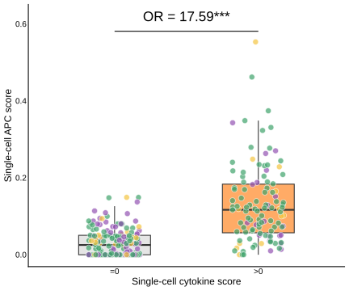
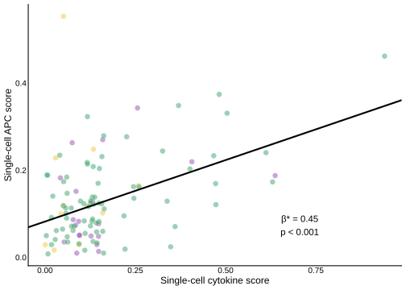
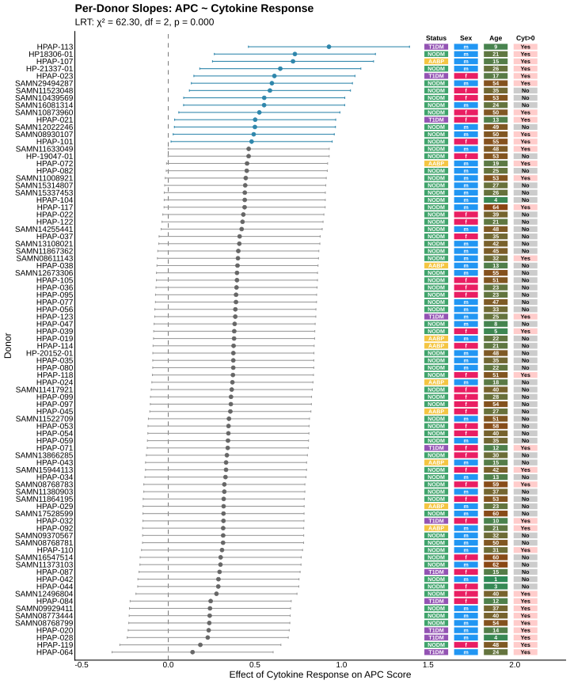

# Ductal cell APC function — single-cell analysis

[](https://doi.org/10.5281/zenodo.21617506)

Code to reproduce the single-cell RNA-seq figures in:

> Erdem N, Arribas-Layton D, Zook HN, O'Meally D, Mares J, Quijano JC, Donohue C,
> Ortiz JA, Jou K, Vasavada RC, Montero E, Kaddis JS, Reijonen H, Ku HT.
> **Human pancreatic ductal cells from non-diabetic donors function as
> non-professional antigen-presenting cells upon inflammatory cytokine exposure.**
> *Diabetologia* 2026;69(8):2323–2337.
> [doi:10.1007/s00125-026-06746-x](https://doi.org/10.1007/s00125-026-06746-x)
> · [PMID 42096071](https://pubmed.ncbi.nlm.nih.gov/42096071/)

This repository covers **only** the computational analysis of publicly available
PanKBase scRNA-seq data — Fig. 1j, Fig. 1k and ESM Fig. 2a. The experimental
work reported in the paper is not part of this pipeline.

## Quick start

```bash
# 1. Get the data (~9 GB) into data/ — see data/README.md
# 2. Install dependencies — see DESCRIPTION
# 3. Run
Rscript reproduce_figures.R
```

Figures are written to `figures/`. Scoring the full 448,935-cell object is the
limiting step and dominates both runtime and memory: a reference run took
**65 minutes** and peaked at **252 GB** on 4 cores.

## Figures

### Fig. 1j — APC programme induction

Cytokine-positive ductal cells have **17.6-fold higher odds** of expressing the
APC programme (OR 17.59 [95% CI 5.53, 56], *p* < 0.001), from the binary
component of the hurdle model fitted to all 20,605 cells from 86 donors.



### Fig. 1k — Dose–response

Among double-positive cells (APC score > 0 **and** cytokine score > 0; 108 cells
from 33 donors), cytokine response magnitude predicts APC magnitude
(β* = 0.45 [95% CI 0.28, 0.62], *p* < 0.001).



### ESM Fig. 2a — Per-donor heterogeneity

Slope estimates for each of the 84 donors with APC-positive cells. All slopes
are positive, though their magnitude varies significantly between donors
(likelihood ratio test *p* < 0.001).



## Analysis

Two gene signatures are scored per cell with
[UCell](https://bioconductor.org/packages/UCell/):

| Signature | Genes |
|---|---|
| Cytokine response | *CXCL9, CXCL10, CXCL11, GBP4, GBP5, NOS2* |
| APC programme | *HLA-DRA, HLA-DRB1, HLA-DRB5, HLA-DQA1, HLA-DQA2, HLA-DQB1, HLA-DPA1, HLA-DPB1, CIITA, CD40, ICAM1, CD74, CTSS, HLA-DMA, HLA-DMB, HLA-DOA, TAP1, TAP2* |

Most cells score zero for the cytokine signature, and cells are clustered within
donors. A **two-part hurdle model** addresses both, with a random intercept per
donor throughout:

- **Part 1 (binary)** — `P(APC > 0) ~ cytokine_positive + (1 | donor)`
  over all cells, giving the odds ratio in Fig. 1j. Asks whether cytokine
  exposure *induces* the APC programme.
- **Part 2 (positive)** — `APC ~ cytokine + (1 | donor)` over double-positive
  cells, giving β* in Fig. 1k. Asks whether, among responding cells, cytokine
  *magnitude* predicts APC *magnitude*.

Effect sizes are standardised as β* = β × SD<sub>x</sub> / SD<sub>y</sub>, which
puts them on the same scale as a correlation coefficient.

Note that the three analyses use different subsets, which are not
interchangeable:

| Analysis | Subset | Cells | Donors |
|---|---|---|---|
| Part 1 (odds ratio) | all cells | 20,605 | 86 |
| Part 2 (β*) | APC > 0 and cytokine > 0 | 108 | 33 |
| Random slopes (ESM Fig. 2a) | APC > 0 | 13,718 | 84 |

## Pipeline

Managed with [targets](https://books.ropensci.org/targets/). `tar_visnetwork()`
shows the graph; `tar_make()` runs it.

```
seurat_file → pankbase_raw → pankbase_mapped → pankbase_scored
                                                     ↓
                                              pankbase_cohort
                                                     ↓
                                               ductal_cells
                                          ↙        ↓        ↘
                              hurdle_model   random_slopes   (metadata)
                                    ↓              ↓
                             fig_1j, fig_1k    esm_fig_2a
```

## Repository layout

```
R/
  constants.R          gene signatures, palette, plot theme
  load_pankbase.R      load the object, standardise metadata
  ucell_scoring.R      UCell signature scoring
  filter_pankbase.R    cohort and cell-type filters
  mixed_models.R       hurdle model, random slopes, forest plot
  manuscript_plots.R   figure functions
_targets.R             pipeline definition
reproduce_figures.R    entry point
DESCRIPTION            dependencies
data/README.md         how to obtain the input data
figures/               output
```

## Citation

If you use this code, please cite the paper above. To cite the code itself, use
the archived version: [doi:10.5281/zenodo.21617506](https://doi.org/10.5281/zenodo.21617506)
(resolves to the latest release).

The bulk mRNA-seq data from the same study are in GEO under
[GSE309294](https://www.ncbi.nlm.nih.gov/geo/query/acc.cgi?acc=GSE309294).

## License

MIT — see [LICENSE](LICENSE).
